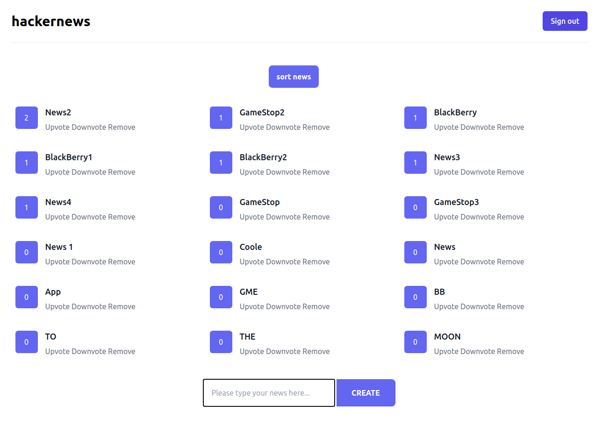
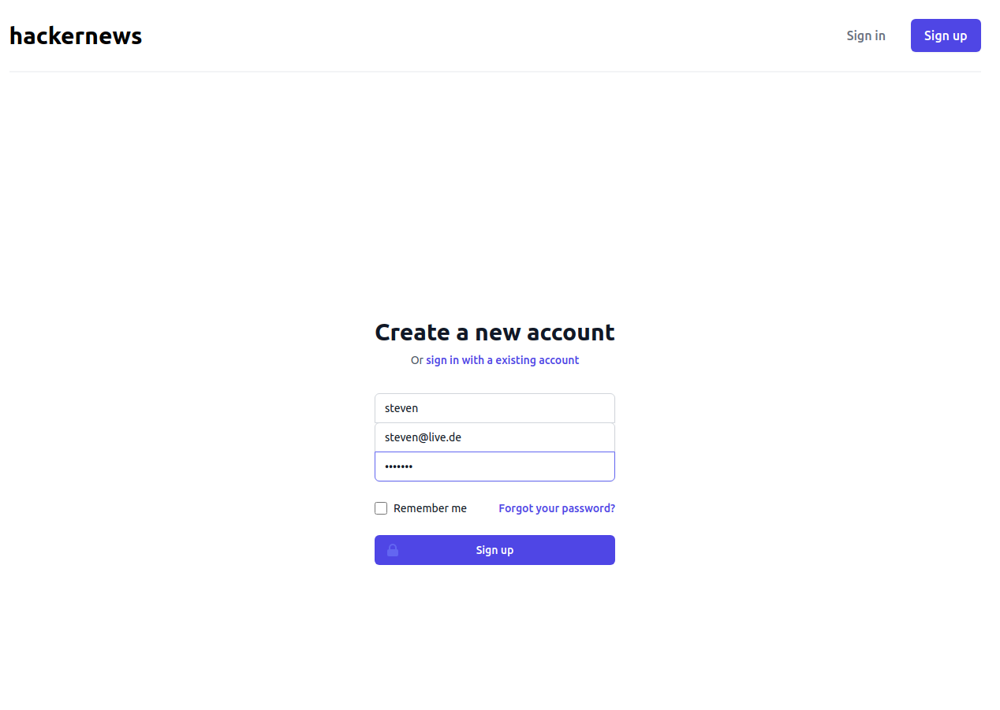

# Hackernews


|         Main page         |         Signup page         |
| :-----------------------: | :-------------------------: |
|  |  |

**Technology Stack**

- [VueJS Frontend](https://vuejs.org/)
- [TailWindCSS](https://tailwindcss.com/)
- [Apollo GraphQL Backend](https://www.apollographql.com), [GraphQL](https://graphql.org/)
- [Neo4J DB](https://neo4j.com/)

**Utility Tools**

- [Jest](https://jestjs.io/docs/en/getting-started)
- [Storybook](https://storybook.js.org)
- [Nuxt](https://nuxtjs.org/)

## Getting Started

**Clone repository**

```bash
https://github.com/steven-mi/hackernews.git
```

**Start the database with docker-compose**

```bash
cd neo4j
docker-compose up --build
```

**Start backend** 

```
cd backend
npm run serve
```

**Start frontend**

```
cd webapp
npm run dev
```

For more detail, look at the `README` files in the sub-directories.

## License

See the [LICENSE](LICENSE.md) file for license rights and limitations (MIT).
